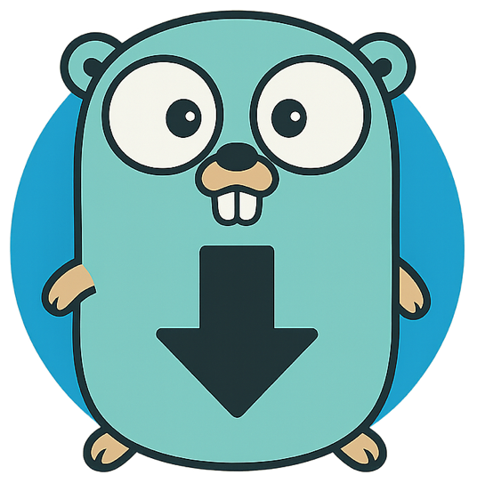

<p align="center">
<picture>
  
</picture>
</p>

# gTorrent

gTorrent is a torrent library and a lightweight command-line BitTorrent client written in Go.

## Features

- Verify torrent files against local content
- Download torrent files from trackers
- Database persistence for downloads and tracker information
- Support for multiple trackers and peer discovery
- Simple command-line interface

## Installation

### Prerequisites

- Go 1.16 or higher

### Building from source

1. Clone the repository:
   ```bash
   git clone https://github.com/yourusername/gtorrent.git
   cd gtorrent
   ```

2. Build the executable:
   ```bash
   go build
   ```

## Usage

```
goTorrent v0.1.0

Usage:
  gtorrent verify <torrent> [<content-path>]
  gtorrent download <torrent>

Commands:
  verify     Verify a torrent file.
  download   Download a torrent file.

Arguments:
  <torrent>       Torrent file to verify/download.
  <content-path>  Path to the content files.
```

### Verifying a torrent

To verify that local files match a torrent file:

```bash
./gtorrent verify path/to/torrent.torrent path/to/content/
```

### Downloading a torrent

To start downloading a torrent:

```bash
./gtorrent download path/to/torrent.torrent
```

## Configuration

gTorrent uses configuration settings for download directory, cache location, and other parameters. These can be configured through environment variables or a configuration file.

## Project Structure

- `config`: Configuration management
- `db`: Database interactions and models
- `torrent`: Core torrent functionality
- `utils`: Utility functions

## Contributing

Contributions are welcome! Please feel free to submit a Pull Request.

1. Fork the repository
2. Create your feature branch (`git checkout -b feature/amazing-feature`)
3. Commit your changes (`git commit -m 'Add some amazing feature'`)
4. Push to the branch (`git push origin feature/amazing-feature`)
5. Open a Pull Request

## License

This project is licensed under the MIT License - see the LICENSE file for details.
